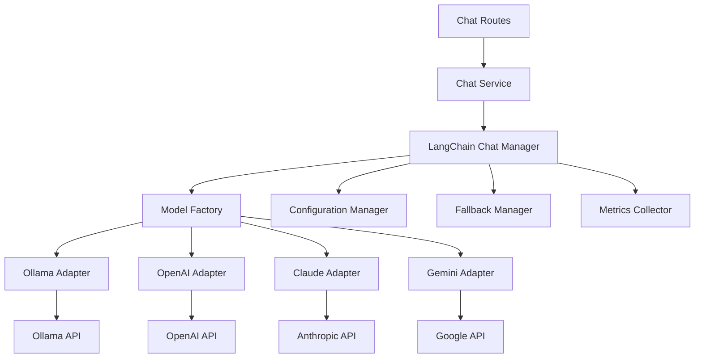

# Design Document

## Overview

本设计文档描述了如何使用 LangChain 框架重构现有的 Ollama 客户端，创建一个支持多个大语言模型提供商的统一聊天服务。该设计采用适配器模式和工厂模式，提供可扩展的架构，支持未来功能扩展。

## Architecture

### 高层架构



### 核心组件

1. **LangChain Chat Manager**: 核心管理器，协调所有模型适配器
2. **Model Factory**: 负责创建和管理不同的模型适配器
3. **Model Adapters**: 各个模型提供商的适配器实现
4. **Configuration Manager**: 统一配置管理
5. **Fallback Manager**: 处理模型故障和回退逻辑
6. **Metrics Collector**: 收集性能和使用指标

## Components and Interfaces

### 1. LangChain Chat Manager

```typescript
interface ChatManager {
  // 发送消息
  sendMessage(request: ChatRequest): Promise<ChatResponse>;
  
  // 流式发送消息
  sendMessageStream(request: ChatRequest): AsyncIterable<ChatStreamChunk>;
  
  // 获取可用模型列表
  getAvailableModels(): Promise<ModelInfo[]>;
  
  // 检查模型可用性
  isModelAvailable(modelId: string): Promise<boolean>;
  
  // 切换默认模型
  setDefaultModel(modelId: string): void;
  
  // 获取模型健康状态
  getModelHealth(): Promise<ModelHealthStatus[]>;
}
```

### 2. Model Adapter Interface

```typescript
interface ModelAdapter {
  // 适配器标识
  readonly providerId: string;
  readonly providerName: string;
  
  // 初始化适配器
  initialize(config: ModelConfig): Promise<void>;
  
  // 发送聊天请求
  chat(messages: ChatMessage[], options?: ChatOptions): Promise<string>;
  
  // 流式聊天
  chatStream(messages: ChatMessage[], options?: ChatOptions): AsyncIterable<string>;
  
  // 获取支持的模型
  getSupportedModels(): Promise<ModelInfo[]>;
  
  // 检查健康状态
  healthCheck(): Promise<boolean>;
  
  // 清理资源
  dispose(): Promise<void>;
}
```

### 3. Configuration Manager

```typescript
interface ConfigurationManager {
  // 加载配置
  loadConfig(): Promise<ChatServiceConfig>;
  
  // 获取模型配置
  getModelConfig(providerId: string): ModelConfig | null;
  
  // 更新配置
  updateConfig(config: Partial<ChatServiceConfig>): void;
  
  // 验证配置
  validateConfig(config: ChatServiceConfig): ValidationResult;
  
  // 监听配置变化
  onConfigChange(callback: (config: ChatServiceConfig) => void): void;
}
```

### 4. Fallback Manager

```typescript
interface FallbackManager {
  // 执行带回退的请求
  executeWithFallback<T>(
    operation: () => Promise<T>,
    fallbackChain: string[]
  ): Promise<T>;
  
  // 记录模型故障
  recordFailure(modelId: string, error: Error): void;
  
  // 检查模型是否可用
  isModelHealthy(modelId: string): boolean;
  
  // 获取下一个可用模型
  getNextAvailableModel(excludeModels?: string[]): string | null;
}
```

## Data Models

### 核心数据结构

```typescript
// 聊天请求
interface ChatRequest {
  messages: ChatMessage[];
  modelId?: string;
  options?: ChatOptions;
  sessionId?: string;
}

// 聊天消息
interface ChatMessage {
  role: 'user' | 'assistant' | 'system';
  content: string;
  timestamp?: Date;
}

// 聊天选项
interface ChatOptions {
  temperature?: number;
  maxTokens?: number;
  topP?: number;
  stream?: boolean;
  timeout?: number;
}

// 聊天响应
interface ChatResponse {
  content: string;
  modelId: string;
  usage?: TokenUsage;
  metadata?: Record<string, any>;
}

// 流式响应块
interface ChatStreamChunk {
  content: string;
  isComplete: boolean;
  modelId: string;
}

// 模型信息
interface ModelInfo {
  id: string;
  name: string;
  providerId: string;
  capabilities: ModelCapabilities;
  pricing?: ModelPricing;
}

// 模型能力
interface ModelCapabilities {
  supportsStreaming: boolean;
  supportsFunctions: boolean;
  maxTokens: number;
  supportedLanguages: string[];
}

// 配置结构
interface ChatServiceConfig {
  defaultModel: string;
  fallbackChain: string[];
  providers: Record<string, ModelConfig>;
  performance: PerformanceConfig;
  security: SecurityConfig;
}

// 模型配置
interface ModelConfig {
  enabled: boolean;
  apiKey?: string;
  baseUrl?: string;
  timeout: number;
  retryAttempts: number;
  rateLimits: RateLimitConfig;
  models: string[];
}
```

## Correctness Properties

*A property is a characteristic or behavior that should hold true across all valid executions of a system-essentially, a formal statement about what the system should do. Properties serve as the bridge between human-readable specifications and machine-verifiable correctness guarantees.*

### Property Reflection

After analyzing all acceptance criteria, I identified several areas where properties can be consolidated:

- Multiple provider support properties (1.1-1.4) can be combined into a single comprehensive provider integration property
- Interface consistency properties (2.1-2.4) can be unified into a single interface uniformity property  
- Streaming properties (3.1-3.4) can be consolidated into comprehensive streaming behavior properties
- Configuration properties (4.1-4.5) can be combined into configuration management properties
- Security properties (7.1-7.5) can be unified into comprehensive security compliance properties

### Core Properties

**Property 1: Multi-Provider Integration**
*For any* supported model provider (Ollama, OpenAI, Claude, Gemini), the Chat Service should successfully process chat requests and return valid responses in the expected format
**Validates: Requirements 1.1, 1.2, 1.3, 1.4, 1.5**

**Property 2: Interface Uniformity**
*For any* model provider, the Chat Service interface should accept the same parameters and return responses in the same format, allowing transparent provider switching
**Validates: Requirements 2.1, 2.2, 2.3, 2.4**

**Property 3: Streaming Behavior Consistency**
*For any* streaming-capable model provider, the Chat Service should deliver streaming responses that maintain message order and can be reconstructed into complete messages
**Validates: Requirements 3.1, 3.2, 3.3, 3.4**

**Property 4: Configuration Management Reliability**
*For any* valid configuration change, the system should apply the change without breaking existing functionality and validate invalid configurations with clear error messages
**Validates: Requirements 4.1, 4.2, 4.3, 4.4, 4.5**

**Property 5: Fallback Strategy Effectiveness**
*For any* model failure scenario, the system should attempt configured fallback models and provide meaningful error messages when all options are exhausted
**Validates: Requirements 5.1, 5.2, 5.3, 5.4, 5.5**

**Property 6: Performance Optimization**
*For any* sequence of requests, the system should reuse connections where possible, implement appropriate caching, and handle timeouts gracefully
**Validates: Requirements 6.1, 6.2, 6.3, 6.4, 6.5**

**Property 7: Security Compliance**
*For any* system operation, sensitive data should be protected, API keys should not be logged, and all external communications should use secure protocols
**Validates: Requirements 7.1, 7.2, 7.3, 7.4, 7.5**

**Property 8: Backward Compatibility**
*For any* existing chat functionality, the new LangChain implementation should maintain the same behavior and data compatibility
**Validates: Requirements 8.1, 8.2, 8.3, 8.4**

**Property 9: Observability Completeness**
*For any* system operation, appropriate logs and metrics should be generated while respecting configured log levels and excluding sensitive data
**Validates: Requirements 9.1, 9.2, 9.3, 9.4, 9.5**

**Property 10: Extensibility Support**
*For any* plugin or extension addition, the core chat functionality should remain stable and the new component should integrate seamlessly
**Validates: Requirements 10.1, 10.2, 10.3, 10.4, 10.5**

## Error Handling

### 错误分类和处理策略

1. **网络错误**: 连接超时、网络不可达
   - 实现指数退避重试
   - 自动切换到备用模型

2. **认证错误**: API 密钥无效、权限不足
   - 记录错误日志
   - 返回明确的错误信息

3. **配置错误**: 无效的模型配置、缺失的必需参数
   - 启动时验证配置
   - 提供配置修复建议

4. **模型错误**: 模型不可用、请求格式错误
   - 尝试备用模型
   - 记录模型健康状态

5. **业务逻辑错误**: 无效的消息格式、超出限制
   - 输入验证和清理
   - 返回用户友好的错误信息

### 错误恢复机制

```typescript
interface ErrorRecoveryStrategy {
  // 重试策略
  retryPolicy: {
    maxAttempts: number;
    backoffMultiplier: number;
    maxDelay: number;
  };
  
  // 回退策略
  fallbackChain: string[];
  
  // 熔断器配置
  circuitBreaker: {
    failureThreshold: number;
    recoveryTimeout: number;
  };
}
```

## Testing Strategy

### 双重测试方法

本系统将采用单元测试和基于属性的测试相结合的方法：

**单元测试**:
- 验证具体的集成点和边界情况
- 测试错误处理和异常情况
- 验证配置加载和验证逻辑
- 测试各个适配器的具体实现

**基于属性的测试**:
- 验证跨所有模型提供商的通用属性
- 测试接口一致性和行为一致性
- 验证流式响应的完整性
- 测试回退和恢复机制

### 测试配置

- **最小迭代次数**: 每个属性测试运行 100 次迭代
- **测试标签格式**: **Feature: langchain-multi-model-integration, Property {number}: {property_text}**
- **测试框架**: 使用 Jest 进行单元测试，fast-check 进行基于属性的测试

### 模拟和测试环境

1. **模型提供商模拟**: 创建模拟适配器用于测试
2. **网络故障模拟**: 测试网络错误和超时情况
3. **配置测试**: 测试各种配置组合和边界情况
4. **性能测试**: 验证连接池和缓存效果

### 集成测试策略

1. **端到端测试**: 测试完整的聊天流程
2. **多模型切换测试**: 验证模型间的无缝切换
3. **故障恢复测试**: 模拟各种故障场景
4. **性能基准测试**: 确保性能不低于现有实现